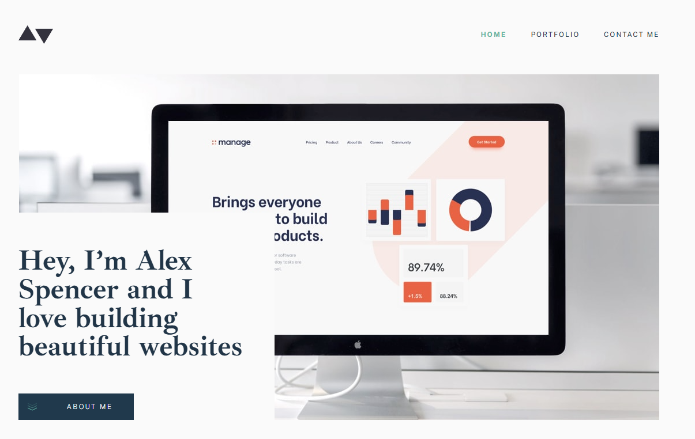

# Frontend Mentor - Minimalist portfolio website solution

This is a solution to the [Minimalist portfolio website challenge on Frontend Mentor](https://www.frontendmentor.io/challenges/minimalist-portfolio-website-LMy-ZRyiE). Frontend Mentor challenges help you improve your coding skills by building realistic projects. 

## Table of contents

- [Overview](#overview)
  - [The challenge](#the-challenge)
  - [Screenshot](#screenshot)
  - [Links](#links)
- [My process](#my-process)
  - [Built with](#built-with)
  - [What I learned](#what-i-learned)
  - [Continued development](#continued-development)
  - [Useful resources](#useful-resources)
- [Author](#author)
- [Acknowledgments](#acknowledgments)

**Note: Delete this note and update the table of contents based on what sections you keep.**

## Overview

### The challenge

Users should be able to:

- View the optimal layout for each page depending on their device's screen size
- See hover states for all interactive elements throughout the site
- Click the "About Me" call-to-action on the homepage and have the screen scroll down to the next section
- Receive an error message when the contact form is submitted if:
  - The `Name`, `Email Address` or `Message` fields are empty should show "This field is required"
  - The `Email Address` is not formatted correctly should show "Please use a valid email address"

### Screenshot



### Links

- Solution URL: [https://github.com/Simplify4Me2/minimalist-portfolio](https://github.com/Simplify4Me2/minimalist-portfolio)
- Live Site URL: [https://simplify4me2.github.io/minimalist-portfolio/](https://simplify4me2.github.io/minimalist-portfolio/)

## My process

### Built with

- Semantic HTML5 markup
- Flexbox
- CSS Grid
- Mobile-first workflow
- [React](https://reactjs.org/) - React framework
- [Tailwind](https://tailwindcss.com/) - CSS framework

### What I learned

Look through the designs to start planning out how you'll tackle the project. This step is crucial to help you think ahead for CSS classes to create reusable styles.
I started creating reusable components way too early in the development process. A big lesson learned is also to try and avoid adding padding or margins to reusable React components. Also, working mobile-first doesn't mean you have to create all of the pages in mobile size first and then gradually adjusting it to tablet and desktop size. This will give you the (false) impression that you're almost done.


To see how you can add code snippets, see below:

```html
<ArticleHeader className="lg:pt-3">Contact Me</ArticleHeader>
```
```js
import { memo, PropsWithChildren } from "react";

const ArticleHeader = memo(
  ({ children, className }: PropsWithChildren<{ className?: string }>) => {
    return (
      <h1
        className={`font-ibarra font-bold text-4xl tracking-tight ${className}`}
      >
        {children}
      </h1>
    );
  }
);

export default ArticleHeader;
```

### Continued development

I tried using [Storybook](https://storybook.js.org/) but ran into an issue when using *react-router-dom* because the Storybook components require the brwoserContext. In the future I would like to dive deeper into Storybook and its advantages.

### Useful resources

- [Tailwind](https://tailwindcss.com/) - Tailwind helps in using utility CSS classes and still allowing for a configurable theme and design.
- [Storybook](https://storybook.js.org/) - This seems like a great tool to bring the Figma design and UI components clser together.

## Author

- Website - [Simon Vereecke](https://simplify4me2.github.io/)
- Frontend Mentor - [@Simplify4Me2](https://www.frontendmentor.io/profile/Simplify4Me2)
- Twitter / X - [@simon_vereecke](https://x.com/simon_vereecke)
- GitHub - [@Simplify4Me2](https://github.com/Simplify4Me2)

## Acknowledgments

Shoutout to my cat, Sakê, for being an absolute cornerstone of this project. Without your relentless commitment to sitting on my keyboard, demanding food at the worst possible moments, and knocking important papers off my desk, I might have actually finished this faster—but where’s the fun in that?

Your unwavering dedication to napping through my struggles and judging me from across the room truly kept me grounded. And let’s not forget the 3 AM zoomies that reminded me that rest is for the weak.

Thanks, Sake. I couldn’t have done it without (or, more accurately, in spite of) you.
